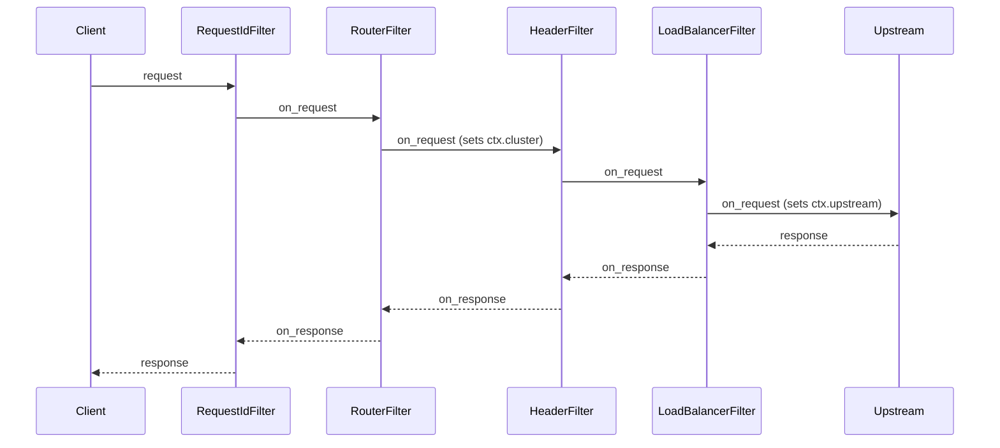
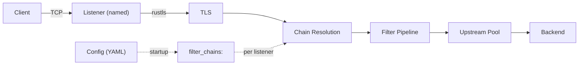
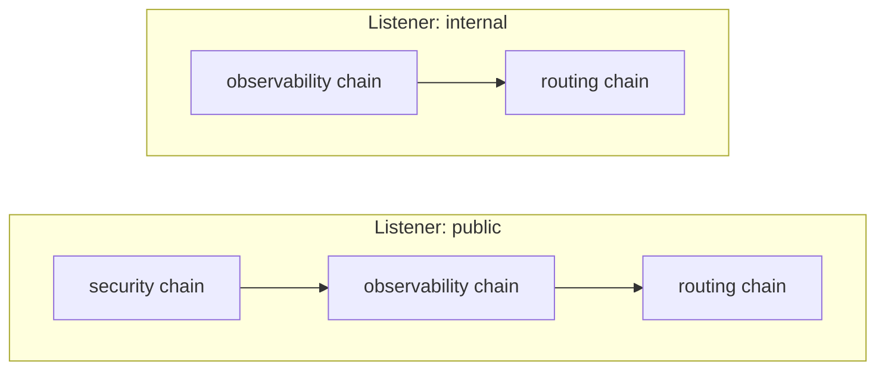
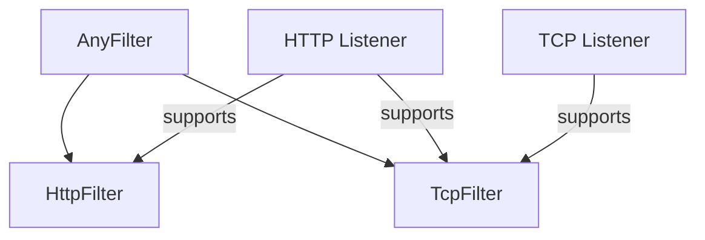
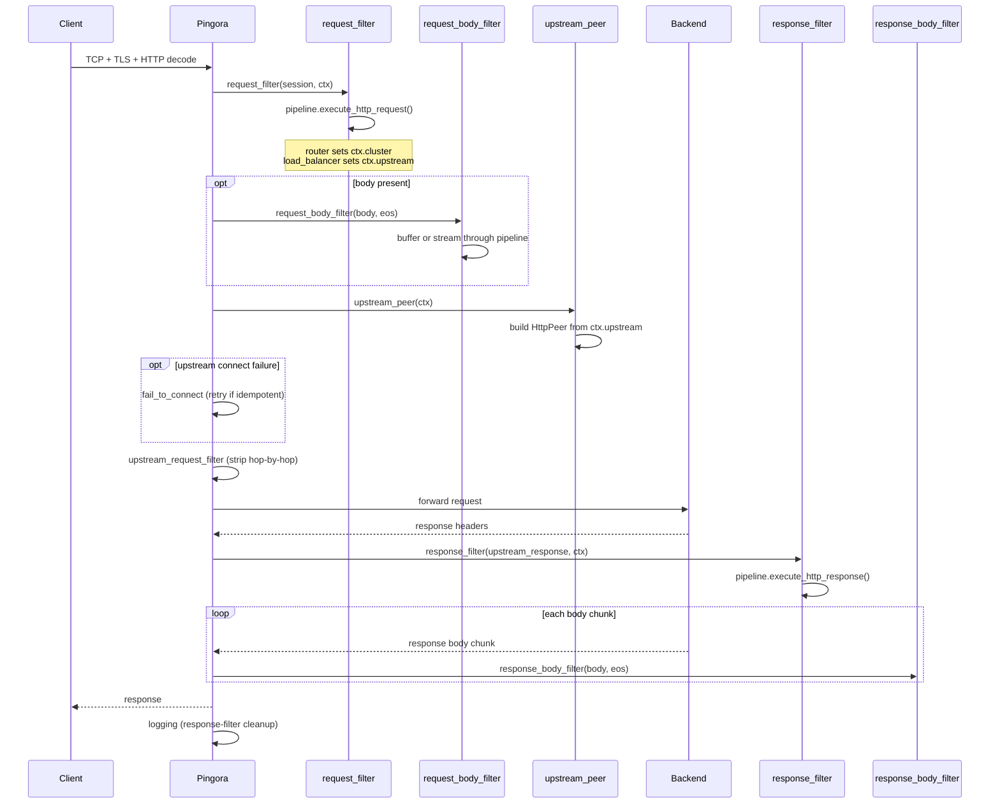
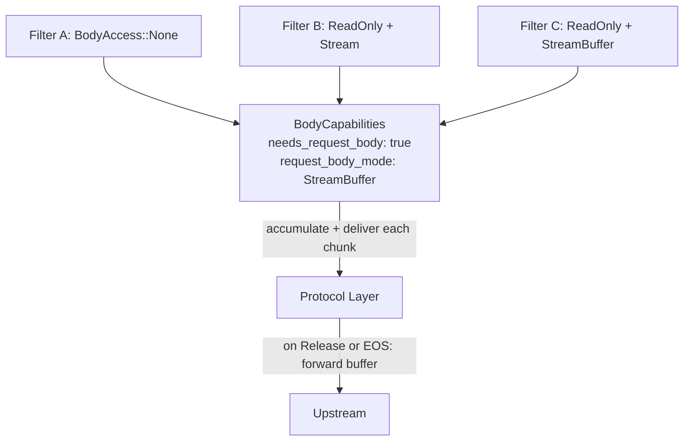
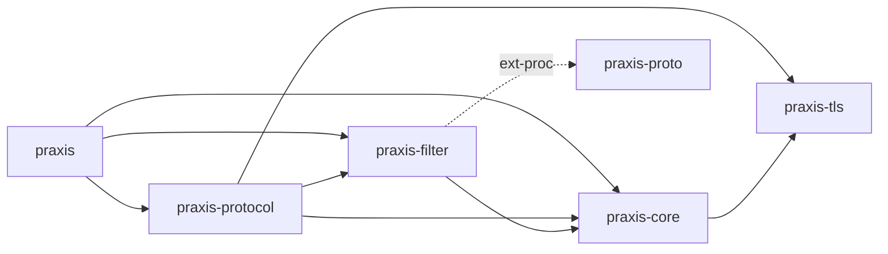
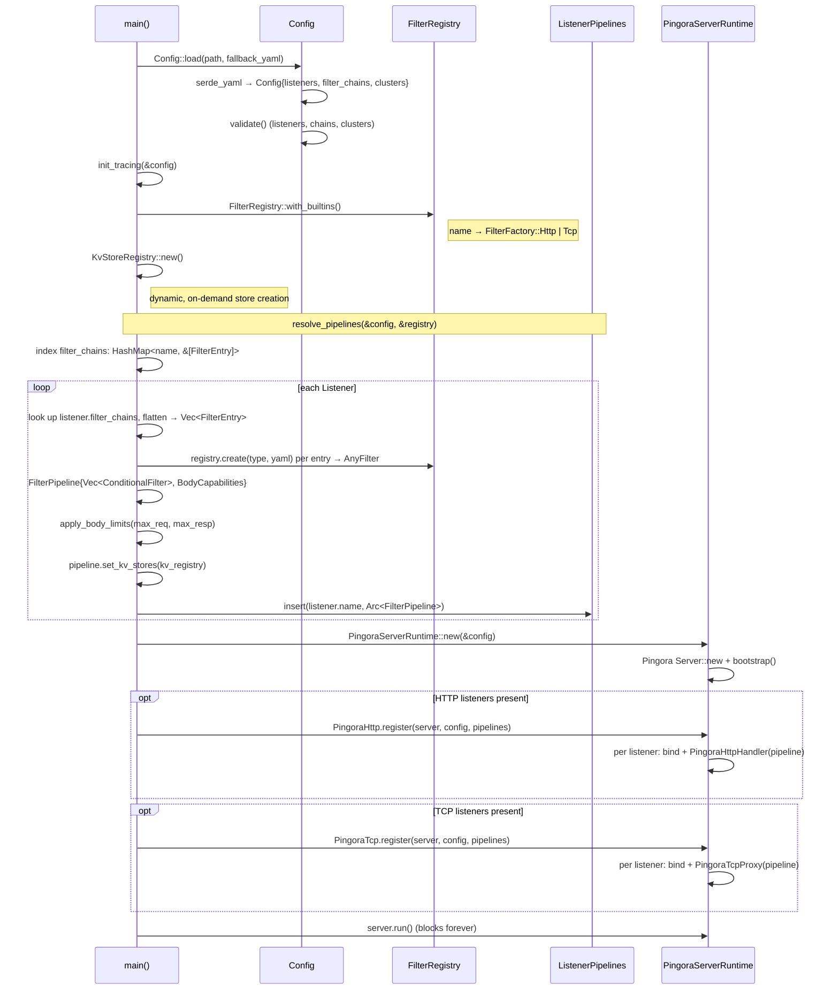

# Architecture

## Design Principles

**Fast.** Performance is a primary design goal.

**Secure by default.** Security is a primary design goal.

**Composable.** Everything is a filter. Routing, load
balancing, rate limiting, AI model selection: all filters,
all using the same traits, all assembled through chains.

**Extensible.** Your filters implement the same [`HttpFilter`]
and [`TcpFilter`] traits as built-in filters. Register with
one macro.

**Adaptive.** Praxis is a framework for building proxies,
not just a proxy. Use a provided build out of the box, or
compose a bespoke proxy server from the same primitives.

[`HttpFilter`]:./filters.md
[`TcpFilter`]:./filters.md

## Primary Use-Cases

- **Ingress**: Reverse proxy, API gateway, edge proxy
- **Egress**: Outbound proxy, service-to-service
- **East/West**: Sidecar or converged proxy for service mesh
- **AI Inference**: Proxy for AI inference workloads
- **AI Agents**: Proxy for AI agents
- **Security Gateway**: Guardrails, Network Policy

## System Architecture

### Protocol Adapters

Adapters translate upstream library callbacks into pipeline
invocations. When feasible Praxis owns no protocol logic,
instead handing it off to well-maintained and battle-tested
upstream solutions.

```text
HTTP  --> praxis-protocol/http  --> Pingora
TCP   --> praxis-protocol/tcp   --> Pingora
QUIC  --> praxis-protocol/http3 --> Quiche  (planned, not yet implemented)
```

These adapters are modular, it's intended to enable adding new protocols by
writing new adapters, and even having multiple implementations of a single
protocol that can be swapped via build features or runtime configuration.

### Filter-First Design

Every behavior is a filter. Built-in filters use the same
traits as user-provided filters.



Request filters run in declared order, response filters in
reverse. Any filter can short-circuit, and multiple payload
processing options are available to do filtering, routing,
caching and load-balancing based on request or response bodies.

See [filters.md] for more extensive documentation on the filter
system, and [extensions.md] for how to write your own.

[filters.md]:./filters.md
[extensions.md]:./extensions.md

### Listeners



Each listener has a `name` and a list of `filter_chains`.
At startup, the referenced chains are resolved and
concatenated into a single pipeline per listener. Different
listeners can compose different subsets of chains.

### Filters

Filter chains are named, reusable groups of filters defined
at the top level of the config. A listener references one or
more chains by name; the filters are concatenated in order
to form that listener's pipeline.



This enables reuse without duplication. A "security" chain
can be shared across public listeners while internal
listeners skip it entirely.

#### Protocol-Aware Filters

Filters are protocol-aware. HTTP filters implement the
`HttpFilter` trait (`on_request`, `on_response`, body hooks).
TCP filters implement the `TcpFilter` trait (`on_connect`,
`on_disconnect`). The `AnyFilter` enum wraps both variants
for storage in a unified pipeline.

Protocol compatibility is enforced via `ProtocolKind::stack()`
and `supports()`. An HTTP listener supports both HTTP and TCP
filters. A TCP listener supports only TCP filters.



### What Stays Outside Filters

- TCP/TLS, HTTP framing, connection pooling: adapters
- Config loading and validation: `praxis-core`
- Pipeline executor and `HttpFilterContext`: `praxis-filter`

## HTTP Connection Lifecycle



1. TCP accept, TLS handshake, HTTP decode (Pingora)
2. `request_filter`: pipeline runs filters in order; router
   sets `ctx.cluster`, load balancer sets `ctx.upstream`
3. `request_body_filter`: buffer or stream body chunks
   through filters (if any filter declares body access)
4. `upstream_peer`: converts `ctx.upstream` to `HttpPeer`
5. Connect to upstream; `fail_to_connect` retries
   idempotent requests on failure
6. `upstream_request_filter`: strips hop-by-hop headers
7. Request forwarded, response headers received
8. `response_filter`: pipeline runs filters in reverse
9. `response_body_filter`: stream response body through
   filters (synchronous; Pingora constraint)
10. `logging`: re-runs response filters if response
    phase was skipped (upstream error, filter rejection)
11. Connection returned to pool

## TCP Connection Lifecycle

1. TCP accept, optional TLS handshake
2. `on_connect` : TCP filters run in order
3. Bidirectional byte forwarding to upstream
4. `on_disconnect` : TCP filters run on close

## Payload Processing

Filters declare body access needs at construction time via
`request_body_access()`, `response_body_access()`, and the
corresponding `*_body_mode()` methods. The pipeline
pre-computes aggregate `BodyCapabilities` at build time so
the protocol layer knows whether to buffer or stream.



Two delivery modes:

- **Stream**: chunks flow through filters as they arrive.
  Low latency, low memory.
- **StreamBuffer**: chunks are delivered to filters
  incrementally (like Stream) but accumulated in a buffer
  and not forwarded to upstream until a filter returns
  `FilterAction::Release` or end-of-stream. After release,
  remaining chunks flow through in stream mode. No size
  limit by default; an optional `max_bytes` returns 413
  when exceeded. Enables streaming inspection with deferred
  forwarding for AI inference, Agentic networks, and
  Security systems use cases including content scanning,
  payload inspection, and body-based routing.

When StreamBuffer mode is active, the protocol layer
pre-reads the body during the request phase (before
upstream selection) so that body filters can influence
routing decisions. The pre-read body is stored and
forwarded to the upstream after the connection is
established.

Precedence: `StreamBuffer` > `SizeLimit` > `Stream`. If
any filter requests `StreamBuffer`, the pipeline uses
stream-buffered mode.
Global `body_limits.max_request_bytes` / `body_limits.max_response_bytes`
config limits force buffer mode for size enforcement even
when no filter requests body access.

The `on_response_body` hook is synchronous (not async)
because Pingora's `response_body_filter` callback is `fn`,
not `async fn`.

## Filter Condition System

Filters can be conditionally executed based on request or
response attributes. Each `FilterEntry` carries optional
`conditions` (request phase) and `response_conditions`
(response phase).

Condition types:

- **`when`**: execute the filter only if the predicate
  matches
- **`unless`**: skip the filter if the predicate matches

Request predicates: `path`, `path_prefix`, `methods`,
`headers`. Response predicates: `status`, `headers`. All
fields within a predicate use AND semantics; multiple
conditions short-circuit in order.

Request conditions gate both `on_request` and body hooks.
Response conditions gate only `on_response` and response
body hooks.

## Dynamic Configuration Reload

Praxis swaps filter pipelines at runtime without
restarting the server or disrupting in-flight requests.

Each handler holds an `Arc<ArcSwap<FilterPipeline>>`
instead of a plain `Arc<FilterPipeline>`. On every
request, the handler calls `pipeline.load()` to get a
snapshot pinned for that request's lifetime. A reload
stores a new pipeline into the `ArcSwap`; the next
request loads the new pointer while in-flight requests
drain on the old one.

A file watcher (`notify` crate, 500ms debounce) monitors
the config file. On change it validates the new config,
rebuilds all pipelines, and swaps them atomically. If
validation fails, nothing changes. Health check tasks
are cancelled and respawned with a fresh registry on
each successful reload.

Changes that cannot be applied dynamically (listener
topology, protocol type, compression module, TLS toggle)
are detected by diffing old and new configs and logged
as warnings.

## Crate Layout

### Workspace Crates

**`praxis`** : Binary entry point. Loads YAML config, resolves
per-listener filter chains into pipelines, registers protocol
handlers, starts the server. Exposes `run_server` and
`init_tracing` for extension binaries.

**`praxis-core`** : Configuration types (YAML parsing via
serde), validation, error types, upstream connectivity
options, `KvStoreRegistry` (concurrent registry of
dynamic key-value stores with pluggable backends), and
the `PingoraServerRuntime` wrapper.

**`praxis-filter`** : Filter pipeline engine. Defines the
`HttpFilter` and `TcpFilter` traits, condition evaluation,
body access declarations, the `FilterPipeline` executor,
`FilterRegistry`, and all built-in filter implementations.

**`praxis-protocol`** : Thin protocol adapters that translate
upstream library callbacks (Pingora) into filter pipeline
invocations. `Protocol` trait, `ListenerPipelines`, HTTP and
TCP implementations.

**`praxis-proto`** : Vendored Envoy ext_proc protocol buffer
definitions compiled into Rust types with tonic/prost gRPC
stubs. Optional dependency of `praxis-filter` behind the
`ext-proc` cargo feature.

**`praxis-tls`** : TLS configuration types and runtime
setup. Defines `ListenerTls` (certificate list, client CA,
cert mode), `ClusterTls` (upstream TLS settings), TLS
certificate loading, and SNI-based certificate selection.
Used by `praxis-core` and `praxis-protocol`.

### Module Tree

```text
benchmarks                      Benchmark tool and library
├── error                       Benchmark error types
├── net                         Network utilities
├── proxy/                      ProxyConfig trait and implementations
│   ├── envoy                   Envoy proxy adapter
│   ├── haproxy                 HAProxy adapter
│   ├── nginx                   NGINX adapter
│   └── praxis                  Praxis proxy adapter
├── report                      Comparison report generation
├── result                      Structured benchmark results
├── runner                      Test orchestration
├── scenario/                   Benchmark scenario definitions
│   ├── settings                Scenario settings
│   └── workload                Workload definitions
└── tools/                      External load generator integrations
    ├── fortio                  Fortio adapter
    └── vegeta                  Vegeta adapter

praxis                          Binary entry point
├── pipelines                   Pipeline resolution from config
├── reload                      Config reload orchestration (validate, swap, health lifecycle)
├── server                      Protocol registration, startup
└── watcher                     File watcher with debounce for config hot-reload

praxis-core                     Configuration, errors, and server factory
├── config/                     YAML parsing, defaults, and validation
│   ├── bootstrap               Config loading with fallback resolution
│   ├── cluster/                Upstream cluster definitions
│   │   ├── endpoint            Endpoint address and weight
│   │   ├── health_check        Per-cluster active health check settings
│   │   └── load_balancer_strategy  Strategy enum (round-robin, least-conn, etc.)
│   ├── condition/              Condition predicates for gating filters
│   │   ├── request             Path, method, header predicates
│   │   └── response            Status code, header predicates
│   ├── validate/               Post-deserialization validation rules
│   │   ├── cluster/            Cluster config validation
│   │   │   ├── endpoints       Endpoint address and weight validation
│   │   │   ├── health_check    Health check config validation
│   │   │   ├── timeouts        Cluster timeout validation
│   │   │   └── tls             Cluster TLS config validation
│   │   ├── listener/           Listener config validation
│   │   │   ├── address         Bind address validation
│   │   │   ├── rules           Listener-level validation rules
│   │   │   └── timeouts        Listener timeout validation
│   │   ├── filter_chain        Filter chain reference validation
│   │   └── rules               Top-level validation orchestration
│   ├── admin                   Admin endpoint address and options
│   ├── body_limits             Global max request/response byte limits
│   ├── filters                 FilterChainConfig and FilterEntry structs
│   ├── insecure_options        Security override flags for development
│   ├── listener                Bind address, protocol, TLS, chain refs
│   ├── parse                   YAML safety checks (size, alias expansion)
│   ├── route                   Route definitions for router filter
│   └── runtime                 Worker threads, work-stealing, log overrides
├── connectivity/               Upstream connection types
│   ├── connection_options      Timeouts, pool sizes, TLS settings
│   ├── network                 CIDR range matching and IP normalization
│   └── upstream                Upstream address representation
├── errors                      ProxyError (shared workspace error type)
├── health                      Shared health state types for active health checking
├── kv/                         Key-value store trait and registry
│   └── memory                  In-memory backend (DashMap)
├── logging                     Tracing subscriber setup
└── server/                     Server factory and lifecycle
    ├── pingora                 Pingora server configuration
    └── runtime                 PingoraServerRuntime wrapper and options

praxis-filter                   Filter pipeline engine
├── actions                     FilterAction: continue or reject
├── any_filter                  AnyFilter enum (Http | Tcp wrapper)
├── body/                       Body access declarations and buffering
│   ├── access                  BodyAccess enum
│   ├── buffer                  BodyBuffer and overflow handling
│   ├── builder                 Pre-computed BodyCapabilities
│   └── mode                    BodyMode enum (Stream, StreamBuffer, SizeLimit)
├── condition/                  Condition evaluation for filter gating
│   ├── request                 Request condition evaluation
│   └── response                Response condition evaluation
├── context                     Transport-agnostic Request/Response types
├── factory                     FilterFactory enum (Http/Tcp) and utilities
├── filter                      HttpFilter trait and HttpFilterContext
├── tcp_filter                  TcpFilter trait and TcpFilterContext
├── registry                    FilterRegistry: name -> factory map
├── pipeline/                   Pipeline execution engine
│   ├── body                    Body chunk processing and buffer management
│   ├── build                   Pipeline construction and body capability computation
│   ├── checks                  Pipeline validation (protocol compatibility)
│   ├── clusters                Cluster reference collection from filters
│   ├── http                    HTTP request/response/body pipeline
│   ├── http_utils              Shared HTTP pipeline utilities
│   ├── tcp                     TCP connect/disconnect pipeline
│   └── tests                   Pipeline unit tests
└── builtins/                   Built-in filter implementations
    ├── http/                   HTTP protocol filters
    │   ├── ai/                 AI filters for HTTP workloads
    │   │   └── inference/      Model routing (model_to_header)
    │   ├── net                 Shared IP utilities (IPv4-mapped normalization)
    │   ├── observability/
    │   │   ├── access_log      Structured JSON request/response logging
    │   │   └── request_id      Correlation ID generation/propagation
    │   ├── payload_processing/
    │   │   ├── compression     Gzip/brotli/zstd response compression
    │   │   └── json_body_field Extract JSON field, promote to header
    │   ├── security/
    │   │   ├── cors            CORS preflight handling, origin validation
    │   │   ├── credential_injection  Per-cluster API key injection
    │   │   ├── forwarded_headers  X-Forwarded-For/Proto/Host injection
    │   │   ├── guardrails      Reject requests matching string/regex rules
    │   │   └── ip_acl          Allow/deny by source IP/CIDR
    │   ├── traffic_management/
    │   │   ├── circuit_breaker Per-cluster circuit breaking (closed/open/half-open)
    │   │   ├── rate_limit      Token bucket rate limiting (per-IP, global)
    │   │   ├── router          Path-prefix + host routing to clusters
    │   │   ├── redirect         3xx redirect without upstream
    │   │   ├── static_response Fixed status/headers/body (no upstream)
    │   │   ├── timeout         504 if response exceeds configured ms
    │   │   └── load_balancer/  Weighted endpoint selection
    │   │       ├── round_robin Round-robin strategy
    │   │       ├── least_connections  Least-connections strategy
    │   │       └── consistent_hash  Consistent-hash strategy
    │   └── transformation/
    │       ├── header          Add/set/remove request/response headers
    │       ├── path_rewrite    Strip/add prefix or regex replace on paths
    │       └── url_rewrite     Regex path transform + query manipulation
    └── tcp/                    TCP protocol filters
        ├── observability/
        │   └── tcp_access_log  Structured JSON connection logging
        └── traffic_management/
            └── sni_router      SNI-based upstream routing

praxis-proto                    Envoy ext_proc protobuf definitions (opt-in via ext-proc feature)
├── envoy/service/common/v3     Common Envoy service types
└── envoy/service/ext_proc/v3   External processor gRPC service

praxis-protocol                 Protocol adapters
├── pipelines                   Maps listener names to resolved pipelines
├── http/                       HTTP (Pingora)
│   └── pingora/                Pingora ProxyHttp integration
│       ├── context             Per-request state through lifecycle hooks
│       ├── convert             Pingora <-> Praxis type conversions
│       ├── health/             Active health checking
│       │   ├── probe           HTTP and TCP health check probe functions
│       │   ├── runner          Background health check runner
│       │   └── service         Admin health-check service (/ready, /healthy)
│       ├── json                JSON HTTP response builder
│       ├── kv                  KV store admin CRUD endpoints
│       ├── listener            TCP/TLS listener setup
│       └── handler/            Request/response lifecycle hooks
│           ├── hop_by_hop           Shared hop-by-hop header stripping logic
│           ├── no_body              ProxyHttp impl without body filter hooks
│           ├── with_body            ProxyHttp impl with body filter hooks
│           ├── request_filter/      Pipeline execution on request
│           │   ├── stream_buffer    Pre-read logic for StreamBuffer mode
│           │   └── validation       Host header validation, Max-Forwards
│           ├── request_body_filter  Body chunk processing (request)
│           ├── response_filter      Pipeline execution on response
│           ├── response_body_filter Body chunk processing (response)
│           ├── upstream_peer        Build HttpPeer from filter context
│           ├── upstream_request     Request-path hop-by-hop stripping
│           ├── upstream_response    Response-path hop-by-hop stripping
│           └── via                  Via header injection
├── tcp/                        L4 bidirectional forwarding
│   ├── proxy                   Bidirectional TCP proxy application
│   └── tls_setup               TLS configuration and listener grouping

praxis-tls                      TLS configuration types and setup
├── client_auth                 Client certificate authentication mode
├── config/                     TLS configuration structs
│   ├── certs                   CaConfig and CertKeyPair types
│   ├── cluster                 ClusterTls upstream TLS settings
│   └── listener                ListenerTls: cert list, client CA, cert mode
├── error                       TlsError type
├── setup/                      TLS runtime setup
│   ├── loader                  Certificate and key loading from disk
│   └── sni                     SNI-based certificate selection
└── sni                         ClientHello SNI parser for TCP routing

xtask                           Developer task runner (cargo xtask)
├── benchmark/                  Benchmark orchestration
│   ├── cli                     CLI argument parsing
│   ├── compare                 Comparison logic
│   ├── flamegraph              Flamegraph generation
│   ├── orchestrate             Test orchestration
│   ├── proxy                   Proxy configuration
│   ├── report                  Report generation
│   ├── resolve                 Resolution logic
│   └── visualize               Result visualization
├── debug                       Debug utilities
├── echo                        Echo server for testing
└── port                        Free port allocation
```

### Dependency Graph



### Startup Sequence



Configuration resolves through three phases. First,
YAML is deserialized into `Config` containing
`Vec<Listener>`, `Vec<FilterChainConfig>`, and
`Vec<Cluster>`, then validated.
Second, `resolve_pipelines` indexes chains by name, then
per listener flattens its named chains into
`FilterEntry` values, instantiates each via the registry
into `AnyFilter`, and assembles a `FilterPipeline` with
pre-computed `BodyCapabilities`. All pipelines collect
into `ListenerPipelines` (listener name →
`Arc<FilterPipeline>`). Third, protocol implementations
bind sockets per listener, attaching handlers that hold
a reference to the listener's resolved pipeline.

### PingoraServerRuntime

`PingoraServerRuntime` wraps the underlying Pingora server. Protocols call
`Protocol::register()` to add their listeners, then the
runtime runs all protocols on a single server. This enables
mixed HTTP + TCP listeners in one process.

Add new protocols by writing an adapter that implements
`Protocol::register()`. Contribute missing capabilities
upstream.

## HTTP Correctness

A proxy must enforce HTTP invariants that upstream servers
and downstream clients may not. These are critical
correctness and security concerns.

The Praxis project _strongly_ prefers relying on
[Cloudflare]'s protocol implementations whenever feasible.
Praxis is modular, so it is possible to swap in other
implementations, but Cloudflare has a good track record of
providing correct, hardened and high performance protocol
implementations which are battle-tested with years of
production experience.

- For TCP, we rely on [Pingora]
- For HTTP/1 + HTTP/2, we rely on [Pingora]
- For QUIC + HTTP/3, we rely on [Quiche]

[Cloudflare]: https://cloudflare.com
[Pingora]: https://github.com/cloudflare/pingora
[Quiche]: https://github.com/cloudflare/quiche

### What Pingora handles

Pingora 0.8.x handles several correctness concerns at
the framework level:

- **Request smuggling**: Content-Length vs
  Transfer-Encoding validation per
  [RFC 9112](https://datatracker.ietf.org/doc/html/rfc9112).
  Invalid Content-Length headers are rejected. Request
  body draining before connection reuse.
- **Backpressure**: H2 flow control and bounded H1
  channels between upstream reader and downstream writer.
- **Connection pool safety**: connections are only pooled
  when requests complete cleanly. Unconsumed response
  bodies cause the connection to be discarded.

### What Praxis handles

- **Hop-by-hop headers**: Pingora does not strip
  hop-by-hop headers on the H1-to-H1 path. Praxis
  strips `Connection`, `Keep-Alive`,
  `Transfer-Encoding`, `TE`, `Trailer`, `Upgrade`,
  and `Proxy-Authenticate`, plus any custom headers
  declared in the `Connection` header value.
  `Proxy-Authorization` is stripped on the request
  path only (it is request-specific per RFC 9110).
  Stripping is applied on both request
  (`upstream_request_filter`) and response
  (`response_filter`) paths per
  [RFC 9110 Section 7.6.1].
- **Host header validation**: Praxis rejects requests
  with conflicting `Host` headers (400) and
  canonicalizes duplicate identical values. Missing
  `Host` on HTTP/1.1 is rejected per
  [RFC 9112](https://datatracker.ietf.org/doc/html/rfc9112).
- **Proxy headers**: Pingora adds no `X-Forwarded-For`,
  `X-Forwarded-Proto`, or similar headers. Praxis
  injects these with configurable trust boundaries
  via the `forwarded_headers` filter.
- **Reserved internal headers**: Praxis uses
  `x-praxis-*`, `x-mcp-*`, and `x-a2a-*` prefixes
  for proxy-internal routing metadata (e.g.
  body-derived fields promoted to headers). These are
  rejected from client requests (400), stripped before
  forwarding to backends, and stripped from backend
  responses before reaching clients.
- **Retry safety**: retries must only apply to idempotent
  requests where no bytes have been written upstream.

[RFC 9110 Section 7.6.1]:https://datatracker.ietf.org/doc/html/rfc9110#section-7.6.1

## Test Structure

All crates have unit tests, but the `tests/` directory contains
integration, conformance and other test suites that operate at
a higher level and across multiple crates.

| Crate | Purpose |
| ------- | --------- |
| `tests/schema` | Config parsing and example validation |
| `tests/conformance` | RFC conformance (h2spec, HTTP semantics) |
| `tests/integration` | End-to-end filter and proxy tests |
| `tests/resilience` | Load, failure recovery, throughput |
| `tests/security` | Request smuggling, header injection |
| `tests/smoke` | Quick startup and round-trip sanity |
