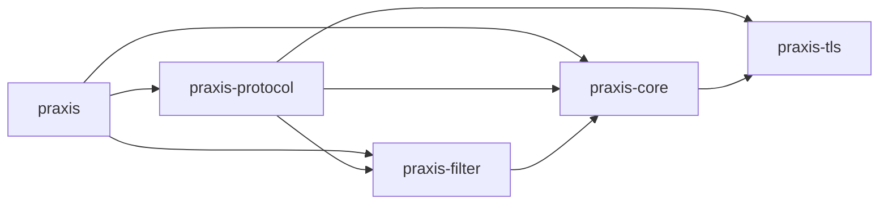
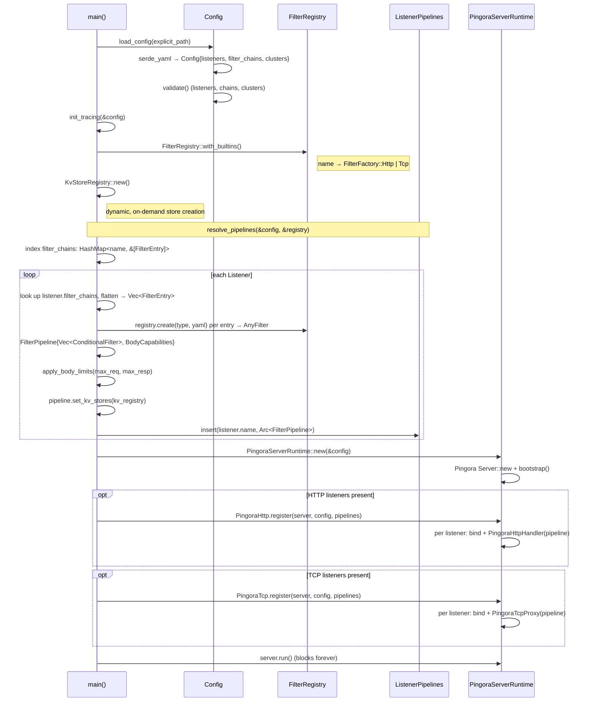

# Crate Layout

## Workspace Crates

**`praxis`** : Binary entry point. Loads YAML config, resolves
per-listener filter chains into pipelines, registers protocol
handlers, starts the server. Exposes `run_server` and
`init_tracing` for extension binaries.

**`praxis-core`** : Configuration types (YAML parsing via
serde), validation, error types, upstream connectivity
options, `KvStoreRegistry` (concurrent registry of
dynamic key-value stores with pluggable backends), and
the `PingoraServerRuntime` wrapper.

**`praxis-filter`** : Filter pipeline engine. Defines the
`HttpFilter` and `TcpFilter` traits, condition evaluation,
body access declarations, the `FilterPipeline` executor,
`FilterRegistry`, and all built-in filter implementations.

**`praxis-protocol`** : Thin protocol adapters that translate
upstream library callbacks (Pingora) into filter pipeline
invocations. `Protocol` trait, `ListenerPipelines`, HTTP and
TCP implementations.

**`praxis-ext-proc`** : Envoy-compatible external processing
filter (anti-pattern — see [filter docs](../filters/README.md#external-processing-anti-pattern)).
Self-contained crate with vendored Envoy protobuf
definitions, gRPC stubs, and the filter implementation.
Not included in the default feature set; registered
explicitly by callers.

**`praxis-tls`** : TLS configuration types and runtime
setup. Defines `ListenerTls` (certificate list, client CA,
cert mode), `ClusterTls` (upstream TLS settings), TLS
certificate loading, and SNI-based certificate selection.
Used by `praxis-core` and `praxis-protocol`.

## Module Tree

```text
benchmarks                      Benchmark tool and library
├── error                       Benchmark error types
├── net                         Network utilities
├── proxy/                      ProxyConfig trait and implementations
│   ├── envoy                   Envoy proxy adapter
│   ├── haproxy                 HAProxy adapter
│   ├── nginx                   NGINX adapter
│   └── praxis                  Praxis proxy adapter
├── report                      Comparison report generation
├── result                      Structured benchmark results
├── runner                      Test orchestration
├── scenario/                   Benchmark scenario definitions
│   ├── settings                Scenario settings
│   └── workload                Workload definitions
└── tools/                      External load generator integrations
    ├── fortio                  Fortio adapter
    └── vegeta                  Vegeta adapter

praxis                          Binary entry point
├── pipelines                   Pipeline resolution from config
├── reload                      Config reload orchestration (validate, swap, health lifecycle)
├── server                      Protocol registration, startup
└── watcher                     File watcher with debounce for config hot-reload

praxis-core                     Configuration, errors, and server factory
├── config/                     YAML parsing, defaults, and validation
│   ├── bootstrap               Config loading with fallback resolution
│   ├── cluster/                Upstream cluster definitions
│   │   ├── endpoint            Endpoint address and weight
│   │   ├── health_check        Per-cluster active health check settings
│   │   └── load_balancer_strategy  Strategy enum (round-robin, least-conn, etc.)
│   ├── condition/              Condition predicates for gating filters
│   │   ├── request             Path, method, header predicates
│   │   └── response            Status code, header predicates
│   ├── validate/               Post-deserialization validation rules
│   │   ├── cluster/            Cluster config validation
│   │   │   ├── endpoints       Endpoint address and weight validation
│   │   │   ├── health_check    Health check config validation
│   │   │   ├── timeouts        Cluster timeout validation
│   │   │   └── tls             Cluster TLS config validation
│   │   ├── listener/           Listener config validation
│   │   │   ├── address         Bind address validation
│   │   │   ├── rules           Listener-level validation rules
│   │   │   └── timeouts        Listener timeout validation
│   │   ├── filter_chain        Filter chain reference validation
│   │   └── rules               Top-level validation orchestration
│   ├── admin                   Admin endpoint address and options
│   ├── body_limits             Global max request/response byte limits
│   ├── filters                 FilterChainConfig and FilterEntry structs
│   ├── insecure_options        Security override flags for development
│   ├── listener                Bind address, protocol, TLS, chain refs
│   ├── parse                   YAML safety checks (size, alias expansion)
│   ├── route                   Route definitions for router filter
│   └── runtime                 Worker threads, work-stealing, log overrides
├── connectivity/               Upstream connection types
│   ├── connection_options      Timeouts, pool sizes, TLS settings
│   ├── network                 CIDR range matching and IP normalization
│   └── upstream                Upstream address representation
├── errors                      ProxyError (shared workspace error type)
├── health                      Shared health state types for active health checking
├── kv/                         Key-value store trait and registry
│   └── memory                  In-memory backend (DashMap)
├── logging                     Tracing subscriber setup
└── server/                     Server factory and lifecycle
    ├── pingora                 Pingora server configuration
    └── runtime                 PingoraServerRuntime wrapper and options

praxis-filter                   Filter pipeline engine
├── actions                     FilterAction: continue or reject
├── any_filter                  AnyFilter enum (Http | Tcp wrapper)
├── body/                       Body access declarations and buffering
│   ├── access                  BodyAccess enum
│   ├── buffer                  BodyBuffer and overflow handling
│   ├── builder                 Pre-computed BodyCapabilities
│   └── mode                    BodyMode enum (Stream, StreamBuffer, SizeLimit)
├── condition/                  Condition evaluation for filter gating
│   ├── request                 Request condition evaluation
│   └── response                Response condition evaluation
├── context                     Transport-agnostic Request/Response types
├── factory                     FilterFactory enum (Http/Tcp) and utilities
├── filter                      HttpFilter trait and HttpFilterContext
├── tcp_filter                  TcpFilter trait and TcpFilterContext
├── registry                    FilterRegistry: name -> factory map
├── pipeline/                   Pipeline execution engine
│   ├── body                    Body chunk processing and buffer management
│   ├── build                   Pipeline construction and body capability computation
│   ├── checks                  Pipeline validation (protocol compatibility)
│   ├── clusters                Cluster reference collection from filters
│   ├── http                    HTTP request/response/body pipeline
│   ├── http_utils              Shared HTTP pipeline utilities
│   ├── tcp                     TCP connect/disconnect pipeline
│   └── tests                   Pipeline unit tests
└── builtins/                   Built-in filter implementations
    ├── http/                   HTTP protocol filters
    │   ├── net                 Shared IP utilities (IPv4-mapped normalization)
    │   ├── observability/
    │   │   ├── access_log      Structured JSON request/response logging
    │   │   └── request_id      Correlation ID generation/propagation
    │   ├── payload_processing/
    │   │   ├── compression     Gzip/brotli/zstd response compression
    │   │   ├── json_body_field Extract JSON field, promote to header
    │   │   └── json_rpc        JSON-RPC 2.0 envelope parsing and metadata extraction
    │   ├── security/
    │   │   ├── cors            CORS preflight handling, origin validation
    │   │   ├── credential_injection  Per-cluster API key injection
    │   │   ├── csrf            CSRF protection via origin validation
    │   │   ├── forwarded_headers  X-Forwarded-For/Proto/Host injection
    │   │   ├── guardrails      Reject requests matching string/regex rules
    │   │   └── ip_acl          Allow/deny by source IP/CIDR
    │   ├── traffic_management/
    │   │   ├── circuit_breaker Per-cluster circuit breaking (closed/open/half-open)
    │   │   ├── rate_limit      Token bucket rate limiting (per-IP, global)
    │   │   ├── router          Path-prefix + host routing to clusters
    │   │   ├── redirect         3xx redirect without upstream
    │   │   ├── static_response Fixed status/headers/body (no upstream)
    │   │   ├── timeout         504 if response exceeds configured ms
    │   │   └── load_balancer/  Weighted endpoint selection
    │   │       ├── round_robin Round-robin strategy
    │   │       ├── least_connections  Least-connections strategy
    │   │       └── consistent_hash  Consistent-hash strategy
    │   └── transformation/
    │       ├── header          Add/set/remove request/response headers
    │       ├── path_rewrite    Strip/add prefix or regex replace on paths
    │       └── url_rewrite     Regex path transform + query manipulation
    └── tcp/                    TCP protocol filters
        ├── observability/
        │   └── tcp_access_log  Structured JSON connection logging
        └── traffic_management/
            ├── sni_router      SNI-based upstream routing
            └── tcp_load_balancer  Cluster-backed TCP endpoint selection

praxis-protocol                 Protocol adapters
├── pipelines                   Maps listener names to resolved pipelines
├── http/                       HTTP (Pingora)
│   └── pingora/                Pingora ProxyHttp integration
│       ├── context             Per-request state through lifecycle hooks
│       ├── convert             Pingora <-> Praxis type conversions
│       ├── health/             Active health checking
│       │   ├── probe           HTTP and TCP health check probe functions
│       │   ├── runner          Background health check runner
│       │   └── service         Admin health-check service (/ready, /healthy)
│       ├── json                JSON HTTP response builder
│       ├── kv                  KV store admin CRUD endpoints
│       ├── listener            TCP/TLS listener setup
│       └── handler/            Request/response lifecycle hooks
│           ├── hop_by_hop           Shared hop-by-hop header stripping logic
│           ├── no_body              ProxyHttp impl without body filter hooks
│           ├── with_body            ProxyHttp impl with body filter hooks
│           ├── request_filter/      Pipeline execution on request
│           │   ├── stream_buffer    Pre-read logic for StreamBuffer mode
│           │   └── validation       Host header validation, Max-Forwards
│           ├── request_body_filter  Body chunk processing (request)
│           ├── response_filter      Pipeline execution on response
│           ├── response_body_filter Body chunk processing (response)
│           ├── upstream_peer        Build HttpPeer from filter context
│           ├── upstream_request     Request-path hop-by-hop stripping
│           ├── upstream_response    Response-path hop-by-hop stripping
│           └── via                  Via header injection
├── tcp/                        L4 bidirectional forwarding
│   ├── proxy                   Bidirectional TCP proxy application
│   └── tls_setup               TLS configuration and listener grouping

praxis-tls                      TLS configuration types and setup
├── client_auth                 Client certificate authentication mode
├── config/                     TLS configuration structs
│   ├── certs                   CaConfig and CertKeyPair types
│   ├── cluster                 ClusterTls upstream TLS settings
│   └── listener                ListenerTls: cert list, client CA, cert mode
├── error                       TlsError type
├── setup/                      TLS runtime setup
│   ├── loader                  Certificate and key loading from disk
│   └── sni                     SNI-based certificate selection
└── sni                         ClientHello SNI parser for TCP routing

xtask                           Developer task runner (cargo xtask)
├── benchmark/                  Benchmark orchestration
│   ├── cli                     CLI argument parsing
│   ├── compare                 Comparison logic
│   ├── flamegraph              Flamegraph generation
│   ├── orchestrate             Test orchestration
│   ├── proxy                   Proxy configuration
│   ├── report                  Report generation
│   ├── resolve                 Resolution logic
│   └── visualize               Result visualization
├── debug                       Debug utilities
├── echo                        Echo server for testing
└── port                        Free port allocation
```

## Dependency Graph



## Startup Sequence



Configuration resolves through three phases. First,
YAML is deserialized into `Config` containing
`Vec<Listener>`, `Vec<FilterChainConfig>`, and
`Vec<Cluster>`, then validated.
Second, `resolve_pipelines` indexes chains by name, then
per listener flattens its named chains into
`FilterEntry` values, instantiates each via the registry
into `AnyFilter`, and assembles a `FilterPipeline` with
pre-computed `BodyCapabilities`. All pipelines collect
into `ListenerPipelines` (listener name →
`Arc<FilterPipeline>`). Third, protocol implementations
bind sockets per listener, attaching handlers that hold
a reference to the listener's resolved pipeline.

### PingoraServerRuntime

`PingoraServerRuntime` wraps the underlying Pingora server. Protocols call
`Protocol::register()` to add their listeners, then the
runtime runs all protocols on a single server. This enables
mixed HTTP + TCP listeners in one process.

Add new protocols by writing an adapter that implements
`Protocol::register()`. Contribute missing capabilities
upstream.

## Test Structure

All crates have unit tests, but the `tests/` directory contains
integration, conformance and other test suites that operate at
a higher level and across multiple crates.

| Crate | Purpose |
| ------- | --------- |
| `tests/schema` | Config parsing and example validation |
| `tests/conformance` | RFC conformance (h2spec, HTTP semantics) |
| `tests/integration` | End-to-end filter and proxy tests |
| `tests/resilience` | Load, failure recovery, throughput |
| `tests/security` | Request smuggling, header injection |

## Related

- [Architecture Overview](overview.md)
- [Connection Lifecycle](connection-lifecycle.md)
- [HTTP Correctness](http-correctness.md)
