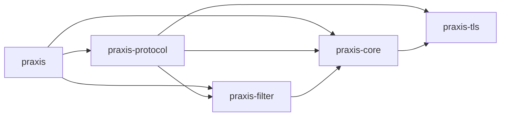
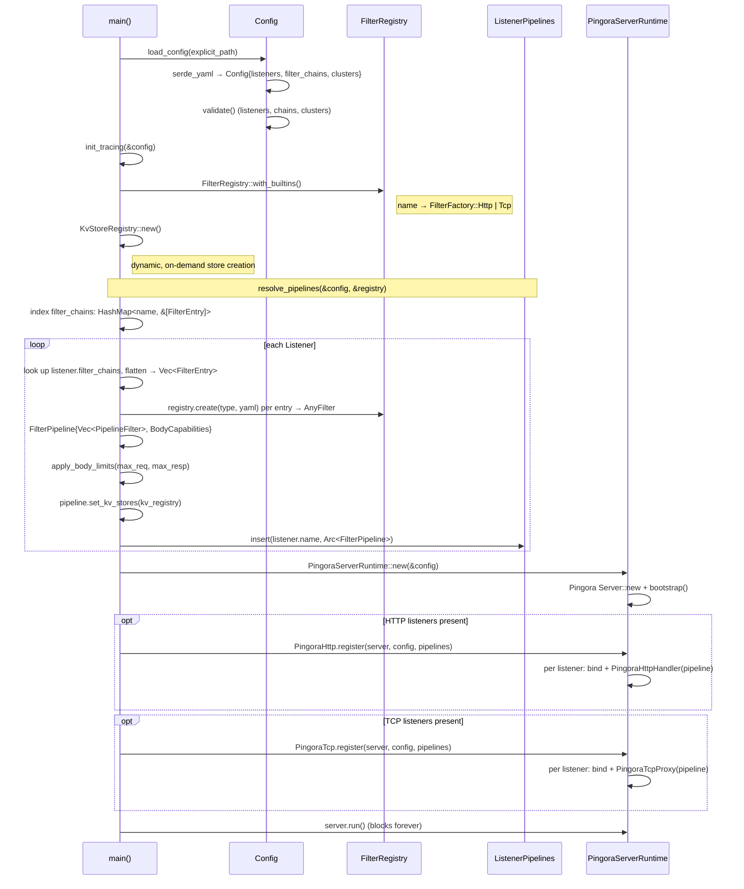

# Crate Layout

## Workspace Crates

**`praxis`** : Binary entry point. Loads YAML config, resolves
per-listener filter chains into pipelines, registers protocol
handlers, starts the server. Exposes `run_server` and
`init_tracing` for extension binaries.

**`praxis-core`** : Configuration types (YAML parsing via
serde), validation, error types, upstream connectivity
options, `KvStoreRegistry` (concurrent registry of
dynamic key-value stores with pluggable backends), and
the `PingoraServerRuntime` wrapper.

**`praxis-filter`** : Filter pipeline engine. Defines the
`HttpFilter` and `TcpFilter` traits, condition evaluation,
body access declarations, the `FilterPipeline` executor,
`FilterRegistry`, and all built-in filter implementations.

**`praxis-protocol`** : Thin protocol adapters that translate
upstream library callbacks (Pingora) into filter pipeline
invocations. `Protocol` trait, `ListenerPipelines`, HTTP and
TCP implementations.

**`praxis-ext-proc`** : Envoy-compatible external processing
filter (anti-pattern — see [filter docs](../filters/README.md#external-processing-anti-pattern)).
Self-contained crate with vendored Envoy protobuf
definitions, gRPC stubs, and the filter implementation.
Not included in the default feature set; registered
explicitly by callers.

**`praxis-tls`** : TLS configuration types and runtime
setup. Defines `ListenerTls` (certificate list, client CA,
cert mode), `ClusterTls` (upstream TLS settings), TLS
certificate loading, and SNI-based certificate selection.
Used by `praxis-core` and `praxis-protocol`.

## Module Tree

```text
praxis                          Binary entry point
├── commands                    CLI helpers (--validate, --dump modes)
├── dump                        Serializable effective config output
├── pipelines                   Config-to-runtime filter pipeline builder
├── reload                      Hot config reload and atomic pipeline swap
├── server                      Server bootstrap and protocol registration
└── watcher                     File watcher for hot config reload

praxis-core                     Configuration, errors, and server factory
├── callout/                    HTTP callout client with circuit breaking
│   └── circuit                 Circuit breaker state machine
├── config/                     YAML parsing, defaults, and validation
│   ├── admin                   Admin endpoint address and options
│   ├── body_limits             Global max request/response byte limits
│   ├── bootstrap               Config loading with fallback resolution
│   ├── branch_chain            Conditional branching in filter pipelines
│   ├── chain_ref               Named or inline chain references
│   ├── cluster/                Upstream cluster definitions
│   │   ├── endpoint            Endpoint address and weight
│   │   ├── health_check        Per-cluster active health check settings
│   │   └── load_balancer_strategy  Strategy enum (round-robin, etc.)
│   ├── condition/              Condition predicates for gating filters
│   │   ├── request             Path, method, header predicates
│   │   └── response            Status code, header predicates
│   ├── filters                 FilterChainConfig and FilterEntry structs
│   ├── insecure_options        Security override flags for development
│   ├── listener                Bind address, protocol, TLS, chain refs
│   ├── parse                   YAML safety checks (size, alias expansion)
│   ├── route                   Route definitions for router filter
│   ├── runtime                 Worker threads, work-stealing, log overrides
│   └── validate/               Post-deserialization validation rules
│       ├── branch_chain        Branch chain cycle and depth validation
│       ├── cluster/            Cluster config validation
│       │   ├── endpoints       Endpoint address and weight validation
│       │   ├── health_check    Health check config validation
│       │   ├── timeouts        Cluster timeout validation
│       │   └── tls             Cluster TLS config validation
│       ├── filter_chain        Filter chain reference validation
│       ├── listener/           Listener config validation
│       │   ├── address         Bind address validation
│       │   ├── rules           Listener-level validation rules
│       │   └── timeouts        Listener timeout validation
│       └── rules               Top-level validation orchestration
├── connectivity/               Upstream connection types
│   ├── connection_options      Timeouts, pool sizes, TLS settings
│   ├── network                 CIDR range matching and IP normalization
│   └── upstream                Upstream address representation
├── errors                      ProxyError (shared workspace error type)
├── health                      Shared health state for active checking
├── id                          Per-instance request ID generation
├── kv/                         Key-value store trait and registry
│   └── memory                  In-memory backend (DashMap)
├── logging                     Tracing subscriber setup
├── memory                      Process-wide memory pressure monitoring
├── server/                     Server factory and lifecycle
│   ├── pingora                 Pingora server configuration
│   └── runtime                 PingoraServerRuntime wrapper and options
└── time                        Wall-clock time abstraction for filters

praxis-filter                   Filter pipeline engine
├── actions                     FilterAction: continue or reject
├── any_filter                  AnyFilter enum (Http | Tcp wrapper)
├── body/                       Body access declarations and buffering
│   ├── access                  BodyAccess enum
│   ├── buffer                  BodyBuffer and overflow handling
│   ├── builder                 Pre-computed BodyCapabilities
│   ├── limits                  Shared body-size defaults
│   └── mode                    BodyMode enum (Stream, StreamBuffer, SizeLimit)
├── condition/                  Condition evaluation for filter gating
│   ├── request                 Request condition evaluation
│   └── response                Response condition evaluation
├── context                     HttpFilterContext and per-request types
├── extensions                  Type-safe request-scoped extension container
├── factory                     FilterFactory enum (Http/Tcp) and utilities
├── filter                      HttpFilter trait definition
├── load_balancing/             Protocol-agnostic load-balancing strategies
│   ├── consistent_hash         Consistent-hash ring selection
│   ├── endpoint                Weighted endpoint type from cluster config
│   ├── least_connections       Least-connections with in-flight tracking
│   ├── p2c                     Power-of-two-choices endpoint selection
│   ├── round_robin             Weighted round-robin via cumulative thresholds
│   └── strategy                Strategy selection and dispatch
├── path_match                  Segment-boundary path prefix matching
├── pipeline/                   Pipeline execution engine
│   ├── body                    Body capabilities computation
│   ├── branch                  Runtime branch types (ResolvedBranch, BranchOutcome)
│   ├── build                   Pipeline construction from config entries
│   ├── build_branch            Recursive branch chain resolution
│   ├── checks                  Ordering validation (router before LB)
│   ├── clusters                Cluster name extraction from entries
│   ├── evaluate                Branch condition evaluation and dispatch
│   ├── extension               PipelineExtension trait for injecting resources
│   ├── filter                  PipelineFilter per-filter wrapper
│   ├── http                    HTTP request/response/body execution loops
│   ├── http_utils              HTTP pipeline utility functions
│   └── tcp                     TCP connect/disconnect execution
├── registry                    FilterRegistry: name -> factory map
├── results                     FilterResultSet for branch chain evaluation
├── tcp_filter                  TcpFilter trait and TcpFilterContext
└── builtins/                   Built-in filter implementations
    ├── http/                   HTTP protocol filters by category
    │   ├── observability/
    │   │   ├── access_log      Structured JSON access log with sampling
    │   │   └── request_id      Request correlation ID injection
    │   ├── payload_processing/
    │   │   ├── compression     Response compression (gzip/brotli/zstd)
    │   │   ├── json_body_field JSON body field extraction to headers
    │   │   └── json_rpc        JSON-RPC envelope parsing filter
    │   ├── security/
    │   │   ├── cors            Cross-origin resource sharing filter
    │   │   ├── credential_injection  Secret injection into upstream headers
    │   │   ├── csrf            Cross-site request forgery protection
    │   │   ├── forwarded_headers  X-Forwarded-* header injection
    │   │   ├── guardrails      PII scanning and content rules
    │   │   ├── ip_acl          IP-based access control (allow/deny)
    │   │   └── policy/         CPEX in-process policy engine (feature-gated)
    │   ├── traffic_management/
    │   │   ├── circuit_breaker Per-cluster circuit breaking
    │   │   ├── endpoint_selector  Header-based upstream endpoint selection
    │   │   ├── grpc_detection  gRPC content-type detection filter
    │   │   ├── load_balancer   Weighted upstream load balancing
    │   │   ├── rate_limit      Token-bucket rate limiting filter
    │   │   ├── redirect        HTTP 3xx redirect without upstream
    │   │   ├── router          Path/method-based request routing
    │   │   ├── static_response Fixed response without upstream contact
    │   │   └── timeout         Request timeout enforcement (504)
    │   └── transformation/
    │       ├── header          Header add/set/remove operations
    │       ├── path_rewrite    Path prefix rewriting filter
    │       └── url_rewrite     Regex-based URL and query rewriting
    └── tcp/                    TCP protocol filters by category
        ├── observability/
        │   └── tcp_access_log  TCP connection access logging
        └── traffic_management/
            ├── sni_router      SNI-based TLS connection routing
            └── tcp_load_balancer  TCP upstream load balancing

praxis-protocol                 Protocol adapters
├── connections                 Process-wide connection limit
├── pipelines                   Hot-swappable pipeline storage (ArcSwap)
├── tls_setup                   Shared TLS settings builder for listeners
├── http/                       HTTP (Pingora)
│   └── pingora/                Pingora ProxyHttp integration
│       ├── context             Per-request state through lifecycle hooks
│       ├── convert             Pingora <-> Praxis type conversions
│       ├── health/             Active health checking
│       │   ├── probe           HTTP and TCP health check probes
│       │   ├── runner          Background health check runner
│       │   └── service         Admin health-check service (/ready, /healthy)
│       ├── json                JSON HTTP response builder
│       ├── kv                  KV store admin CRUD endpoints
│       ├── listener            TCP/TLS listener setup
│       ├── metrics             Prometheus metrics and scrape endpoint
│       └── handler/            Request/response lifecycle hooks
│           ├── hop_by_hop           Hop-by-hop header stripping (RFC 9110)
│           ├── no_body              Handler without body filter hooks
│           ├── normalize            Request header normalization
│           ├── reserved_headers     Reserved internal header helpers
│           ├── with_body            Handler with body filter hooks
│           ├── request_filter/      Pipeline execution on request
│           │   ├── stream_buffer    Pre-read logic for StreamBuffer mode
│           │   └── validation       Host header and Max-Forwards validation
│           ├── request_body_filter  Body chunk processing (request)
│           ├── response_filter      Pipeline execution on response
│           ├── response_body_filter Body chunk processing (response)
│           ├── upstream_peer        Build HttpPeer from filter context
│           ├── upstream_request     Request-path rewriting
│           ├── upstream_response    Response-path hop-by-hop stripping
│           └── via                  Via header injection (RFC 9110)
└── tcp/                        L4 bidirectional forwarding
    ├── proxy                   Bidirectional TCP proxy application
    └── tls_setup               TCP TLS configuration and listener grouping

praxis-tls                      TLS configuration types and setup
├── cached                      Pre-parsed TLS certificate data caching
├── client_auth                 Client certificate verifier for mTLS
├── config/                     TLS configuration structs
│   ├── certs                   CaConfig and CertKeyPair types
│   ├── cluster                 ClusterTls upstream TLS settings
│   └── listener                ListenerTls: cert list, client CA, cert mode
├── error                       TlsError type
├── reload                      Hot-reloadable certificate resolver
├── setup/                      TLS runtime setup
│   ├── loader                  Certificate and key loading from disk
│   └── sni                     SNI-based multi-cert resolver
├── sni                         Zero-copy ClientHello SNI parser
└── watcher                     Filesystem watcher for cert hot-reload

xtask                           Developer task runner (cargo xtask)
├── benchmark/                  Benchmark orchestration
│   ├── cli                     CLI argument types and subcommands
│   ├── compare                 Report comparison and regression detection
│   ├── flamegraph              CPU profiling with flamegraphs
│   ├── orchestrate             Benchmark orchestration and report assembly
│   ├── proxy                   Proxy config builders and Docker management
│   ├── report                  Benchmark report serialization
│   ├── resolve                 Workload and proxy name resolution
│   └── visualize               SVG chart generator for results
├── debug                       Run praxis with dev settings
├── echo                        Quick HTTP test echo server
├── filter_docs                 Generate and lint per-filter documentation
├── lint_deps                   Enforce three-component semver in deps
├── lint_example_tests          Enforce example config test coverage
├── port                        Port availability utilities
└── sync_example_readme         Generate examples/README.md table
```

## Dependency Graph



## Startup Sequence



Configuration resolves through three phases. First,
YAML is deserialized into `Config` containing
`Vec<Listener>`, `Vec<FilterChainConfig>`, and
`Vec<Cluster>`, then validated.
Second, `resolve_pipelines` indexes chains by name, then
per listener flattens its named chains into
`FilterEntry` values, instantiates each via the registry
into `AnyFilter`, and assembles a `FilterPipeline` with
pre-computed `BodyCapabilities`. All pipelines collect
into `ListenerPipelines` (listener name →
`Arc<FilterPipeline>`). Third, protocol implementations
bind sockets per listener, attaching handlers that hold
a reference to the listener's resolved pipeline.

### PingoraServerRuntime

`PingoraServerRuntime` wraps the underlying Pingora server. Protocols call
`Protocol::register()` to add their listeners, then the
runtime runs all protocols on a single server. This enables
mixed HTTP + TCP listeners in one process.

Add new protocols by writing an adapter that implements
`Protocol::register()`. Contribute missing capabilities
upstream.

## Test Structure

All crates have unit tests, but the `tests/` directory contains
integration, conformance and other test suites that operate at
a higher level and across multiple crates.

| Crate | Purpose |
| ------- | --------- |
| `tests/schema` | Config parsing and example validation |
| `tests/conformance` | RFC conformance (h2spec, HTTP semantics) |
| `tests/integration` | End-to-end filter and proxy tests |
| `tests/resilience` | Load, failure recovery, throughput |
| `tests/security` | Request smuggling, header injection |

## Related

- [Architecture Overview](overview.md)
- [Connection Lifecycle](connection-lifecycle.md)
- [HTTP Correctness](http-correctness.md)
