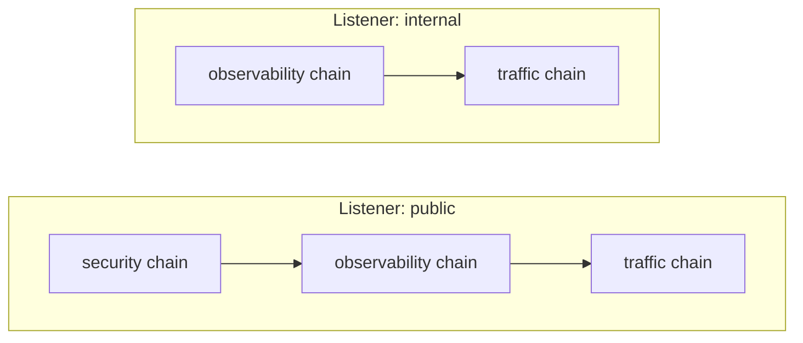
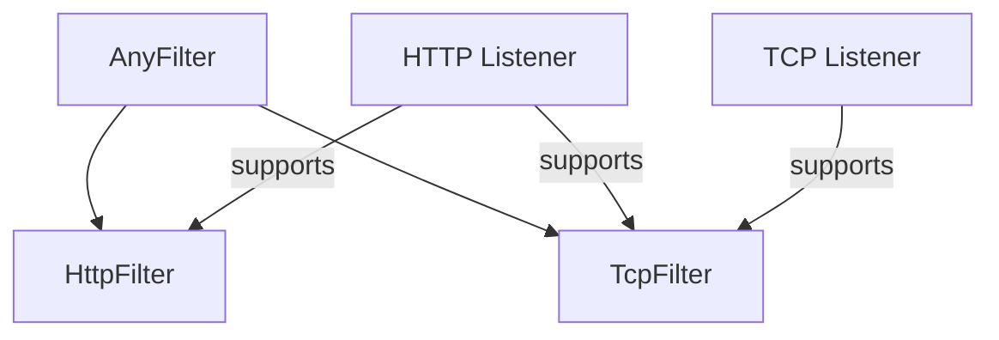

# Filters

## Filter Model

Filters are the core processing units in Praxis. Each
filter is a small (preferably), composable function that
inspects or transforms traffic at a single point in the
request/response lifecycle.

Filters are chained into pipelines; the pipeline executor
calls each filter in order on requests and in reverse on responses.

For listener and chain resolution architecture, see
the [architecture overview](../architecture/overview.md).

### What Filters Receive

**HTTP filters** receive an `HttpFilterContext` containing:

- `client_addr`: downstream IP (from the TCP connection)
- `downstream_tls`: whether the client connection uses TLS
- `health_registry`: endpoint health state
- `request`: method, URI, and headers
- `response_header`: response status and headers (**only in response phase**)
- `cluster` / `upstream`: current routing selections (may be set by earlier filters)
- `rewritten_path`: path set by a preceding rewrite filter (**Praxis will include this in routing decisions**)
- Request and response body chunks (only if the filter declares `BodyAccess::ReadOnly` or `BodyAccess::ReadWrite`)

**TCP filters** receive a `TcpFilterContext` with
connection metadata: `remote_addr`, `local_addr`, `sni`
(SNI hostname from TLS ClientHello), `upstream_addr`
(mutable via `Cow`), timing, and byte counters.

### What Filters Can Do

Every filter hook returns a `FilterAction`:

- **`Continue`**: pass to the next filter in the pipeline.
- **`Reject`**: short-circuit with an HTTP response (status code, optional headers and body).
  Used by `static_response`, `redirect`, `rate_limit`, `guardrails`, `cors` preflight, and similar filters.
- **`Release`**: forward accumulated body data to upstream when using `StreamBuffer` mode.
  Behaves as `Continue` when body data is not relevant.

Filters also mutate `HttpFilterContext` fields to
influence downstream processing:

- `ctx.cluster`: select which upstream cluster to route to.
- `ctx.upstream`: select a specific endpoint.
- `ctx.rewritten_path`: rewrite the upstream request path.
- `ctx.extra_request_headers`: inject headers into the
  upstream request.
- `ctx.request_headers_to_set`: overwrite headers on the
  upstream request.
- `ctx.request_headers_to_remove`: remove headers from the
  upstream request.
- `ctx.filter_metadata`: write durable per-request metadata.
- `ctx.filter_results`: write key-value results for
  [branch chain](branch-chains.md) evaluation. Results
  are keyed by the filter's TYPE name (the return value
  of `HttpFilter::name()`). See
  [Pipeline Concepts: Filter Results](../architecture/pipeline-concepts.md#filter-results)
  for the full lifecycle.
- `ctx.response_header`: mutate response headers directly
  in `on_response`.
- `ctx.response_headers_modified`: flag that response
  headers were changed.

### Lifecycle Hooks

| Hook | Direction | Phase |
| --- | --- | --- |
| `on_request` | Forward (pipeline order) | Request |
| `on_response` | Reverse (pipeline order) | Response |
| `on_request_body` | Forward | Request body chunks |
| `on_response_body` | Reverse | Response body chunks |

Request `conditions` gate both the request and body
hooks. Response `response_conditions` gate only the
response hooks. A filter skipped on request is also
skipped on response.

### Common Patterns

See [`examples/configs/`] for working examples of every
pattern. A few highlights:

- **Host-based routing**: [hosts.yaml]
- **Path-based routing with rewriting**: [path-based-routing.yaml]
- **Security chain** (guardrails + IP ACL): [guardrails.yaml], [ip-acl.yaml]
- **Rate limiting with headers**: [rate-limiting.yaml]
- **Composed filter chains**: [composed-chains.yaml]
- **Conditional filters**: [conditional-filters.yaml]
- **Production gateway**: [production-gateway.yaml]

[`examples/configs/`]: ../../examples/configs/
[hosts.yaml]: ../../examples/configs/traffic-management/hosts.yaml
[path-based-routing.yaml]: ../../examples/configs/traffic-management/path-based-routing.yaml
[guardrails.yaml]: ../../examples/configs/security/guardrails.yaml
[ip-acl.yaml]: ../../examples/configs/security/ip-acl.yaml
[rate-limiting.yaml]: ../../examples/configs/traffic-management/rate-limiting.yaml
[composed-chains.yaml]: ../../examples/configs/pipeline/composed-chains.yaml
[conditional-filters.yaml]: ../../examples/configs/pipeline/conditional-filters.yaml
[production-gateway.yaml]: ../../examples/configs/operations/production-gateway.yaml

## Filter Chains (Pipelining)

Filter chains are named, reusable groups of filters defined
at the top level of the config. A listener references one or
more chains by name; the filters are concatenated in order
to form that listener's pipeline. This config-time assembly
is called **pipelining** — it decides *what processing* a
request receives. It is distinct from **routing**, where
the `router` filter selects an upstream cluster at request
time.



This enables reuse without duplication. A "security" chain
can be shared across public listeners while internal
listeners skip it entirely.

For conditional branching within pipelines, see
[Branch Chains](branch-chains.md). For the full mental
model of how chains become pipelines, see
[Pipeline Concepts](../architecture/pipeline-concepts.md).

### Protocol-Specific Filters

Every filter belongs to exactly one protocol level. HTTP
filters implement the `HttpFilter` trait (`on_request`,
`on_response`, body hooks). TCP filters implement the
`TcpFilter` trait (`on_connect`, `on_disconnect`). There
is no generic filter that operates at both levels. The
`AnyFilter` enum tags each filter with its protocol for
storage in a unified pipeline.

Built-in filters are organized by protocol, then by
category:

```text
builtins/
  http/                       HTTP protocol filters
    observability/            Access logs, request IDs
    payload_processing/       Compression, body field extraction, JSON-RPC
    security/                 CORS, credential injection, CSRF, forwarded headers, guardrails, IP ACL, policy
    traffic_management/       Circuit breaker, gRPC detection, router, load balancer, timeout, rate limit, redirect, static response
    transformation/           Header, path rewrite, URL rewrite
  tcp/                        TCP protocol filters
    observability/            Connection logging
    traffic_management/       SNI router, TCP load balancer
```

At runtime, pipeline execution dispatches to the correct
filter type. HTTP execution (`execute_http_request`,
`execute_http_response`, body hooks) calls only HTTP
filters, skipping TCP entries. TCP execution
(`execute_tcp_connect`, `execute_tcp_disconnect`) calls
only TCP filters, skipping HTTP entries.

**Protocol stack model.** Higher-level protocols include
lower levels. HTTP's stack includes TCP, so an HTTP
listener accepts both HTTP and TCP filters in its
pipeline. A TCP listener accepts only TCP filters.
Validation enforces this via `ProtocolKind::supports()`.

| Listener Protocol | HTTP Filters | TCP Filters |
| --- | --- | --- |
| `http` (default) | Yes | Yes |
| `tcp` | No | Yes |



## External Processing (Anti-Pattern)

> **Warning**: External processing (`ext_proc`) is an
> anti-pattern. Do not use it unless you are certain
> it must be used.

The `ext_proc` filter sends request and response data to
an external gRPC server via the Envoy external processing
protocol. It exists for backwards compatibility with
Envoy deployments and for situations where no other
solution is viable.

**Why to avoid it:**

- Adds a gRPC network hop to every request (latency)
- Introduces a new failure domain (the gRPC server)
- Requires operating and monitoring a separate service
- Praxis native filters do the same work in-process
  with zero-copy body streaming and no network boundary

**What to use instead:**

- **Body inspection**: `json_body_field`, `guardrails`,
  `StreamBuffer` mode in a custom filter
- **Header transforms**: `headers`, `forwarded_headers`,
  classifier filters
- **Routing decisions**: `router` + `load_balancer`,
  branch chains
- **Custom logic**: write a native `HttpFilter` — it
  runs in-process with full pipeline context

The `ext_proc` filter lives in a separate crate
(`praxis-ext-proc`) and must be registered explicitly.
Production deployments should plan to replace
`ext_proc` usage with native filters.

## What Stays Outside Filters

- TCP/TLS, HTTP framing, connection pooling: adapters
- Config loading and validation: `praxis-core`
- Pipeline executor and `HttpFilterContext`: `praxis-filter`

## HttpFilter Trait

Every HTTP behavior in Praxis is an `HttpFilter`:

```rust
#[async_trait]
pub trait HttpFilter: Send + Sync {
    fn name(&self) -> &'static str;
    async fn on_request(
        &self, ctx: &mut HttpFilterContext<'_>,
    ) -> Result<FilterAction, FilterError>;
    async fn on_response(
        &self, ctx: &mut HttpFilterContext<'_>,
    ) -> Result<FilterAction, FilterError> {
        Ok(FilterAction::Continue)
    }
    // Body hooks and access/mode methods omitted for
    // brevity; see "Body Access" section below.
}
```

The trait also defines body access, body mode, and body
hook methods. See [Body Access](#body-access-http-only)
below for the full API.

`on_request` runs in order, `on_response` in reverse.

## TcpFilter Trait

TCP-level filters implement `TcpFilter`:

```rust
#[async_trait]
pub trait TcpFilter: Send + Sync {
    fn name(&self) -> &'static str;
    async fn on_connect(
        &self, ctx: &mut TcpFilterContext<'_>,
    ) -> Result<FilterAction, FilterError> {
        Ok(FilterAction::Continue)
    }
    async fn on_disconnect(
        &self, ctx: &mut TcpFilterContext<'_>,
    ) -> Result<(), FilterError> {
        Ok(())
    }
}
```

`on_connect` fires when a TCP connection is accepted.
`on_disconnect` fires when the connection closes. Both
hooks have default implementations that pass through.

## FilterAction

- `Continue` : pass to next filter
- `Reject(rejection)` : stop pipeline, respond now
- `Release` : forward accumulated StreamBuffer data to
  upstream; behaves as `Continue` in non-StreamBuffer
  contexts
- `BodyDone` : signal that this filter has finished body
  processing; subsequent body chunks skip this filter
  while other filters continue normally

```rust
FilterAction::Reject(Rejection::status(429)
    .with_header("Retry-After", "60")
    .with_body(b"rate limit exceeded" as &[u8]))
```

## HttpFilterContext

Shared state flowing through HTTP filters for a request:

```rust
pub struct HttpFilterContext<'a> {
    pub client_addr: Option<IpAddr>,
    pub cluster: Option<Arc<str>>,
    pub downstream_tls: bool,
    pub extensions: RequestExtensions,
    pub extra_request_headers: Vec<(Cow<'static, str>, String)>,
    pub filter_metadata: HashMap<String, String>,
    pub filter_results: HashMap<&'static str, FilterResultSet>,
    pub filter_state: HashMap<usize, Box<dyn Any + Send + Sync>>,
    pub health_registry: Option<&'a HealthRegistry>,
    pub id_generator: &'a IdGenerator,
    pub kv_stores: Option<&'a KvStoreRegistry>,
    pub pre_read_mutations: Vec<TrustedHeaderMutation>,
    pub request: &'a Request,
    pub request_body_bytes: u64,
    pub request_body_mode: BodyMode,
    pub request_headers_to_remove: Vec<HeaderName>,
    pub request_headers_to_set: Vec<(HeaderName, HeaderValue)>,
    pub request_start: Instant,
    pub response_body_bytes: u64,
    pub response_body_mode: BodyMode,
    pub response_header: Option<&'a mut Response>,
    pub response_headers_modified: bool,
    pub rewritten_path: Option<String>,
    pub selected_endpoint_index: Option<usize>,
    pub structured_metadata: HashMap<String, serde_json::Value>,
    pub time_source: &'a dyn TimeSource,
    pub upstream: Option<Upstream>,
    // Internal pipeline tracking fields omitted.
}
```

## TcpFilterContext

Per-connection state for TCP filters:

```rust
pub struct TcpFilterContext<'a> {
    pub remote_addr: &'a str,
    pub local_addr: &'a str,
    pub sni: Option<&'a str>,
    pub upstream_addr: Option<Cow<'a, str>>,
    pub cluster: Option<Arc<str>>,
    pub connect_time: Instant,
    pub bytes_in: u64,
    pub bytes_out: u64,
    pub health_registry: Option<&'a HealthRegistry>,
    pub kv_stores: Option<&'a KvStoreRegistry>,
}
```

The `sni` field is populated by the TCP proxy when it peeks
at the first bytes of a TLS connection and extracts the SNI
hostname from the ClientHello. Filters like `sni_router` use
this to select an upstream. The `upstream_addr` field is an
`Option<Cow>` — `None` until a static upstream or filter
provides one; filters can replace it with an owned value.
The `cluster` field names the selected cluster, and
`health_registry` / `kv_stores` provide access to shared
runtime state.

## AnyFilter

The `AnyFilter` enum wraps both filter variants for storage
in a unified registry and pipeline:

```rust
pub enum AnyFilter {
    Http(Box<dyn HttpFilter>),
    Tcp(Box<dyn TcpFilter>),
}
```

Each variant reports its `protocol_level()` as
`ProtocolKind::Http` or `ProtocolKind::Tcp`.

## Body Access (HTTP only)

Filters see headers only by default. Opt in:

```rust
fn request_body_access(&self) -> BodyAccess {
    BodyAccess::ReadOnly // or ReadWrite
}
```

| Access           | Hooks? | Modify? |
| ---------------- | ------ | ------- |
| `None` (default) | No     | No      |
| `ReadOnly`       | Yes    | No      |
| `ReadWrite`      | Yes    | Yes     |

### Body Mode

| Mode                          | Behavior        | Use case                  |
| ----------------------------- | --------------- | ------------------------- |
| `Stream` (default)            | Per chunk       | Logging, transforms       |
| `StreamBuffer { max_bytes }`  | Deferred stream | Inspection before forward |
| `SizeLimit { max_bytes }`     | Stream + ceiling | Global size enforcement  |

If any filter requests `StreamBuffer`, the pipeline
defers upstream forwarding until release. `SizeLimit`
streams chunks without buffering but enforces a byte
ceiling, returning 413 on overflow. It is used when no
filter needs body access but a global size limit is
configured. Precedence: `StreamBuffer` > `SizeLimit` >
`Stream`.

### StreamBuffer Mode

`StreamBuffer` combines streaming inspection with deferred
forwarding. Filters see each chunk as it arrives (like
`Stream`) but the protocol layer accumulates them and does
not forward to upstream until a filter returns
`FilterAction::Release` or end-of-stream is reached.

```rust
fn request_body_mode(&self) -> BodyMode {
    // No limit (default):
    BodyMode::StreamBuffer { max_bytes: None }

    // With a limit (413 on overflow):
    // BodyMode::StreamBuffer { max_bytes: Some(1_048_576) }
}
```

A filter signals release by returning
`FilterAction::Release` from `on_request_body` or
`on_response_body`. After release, remaining chunks flow
through in stream mode.

When `max_bytes` is `None` (default), StreamBuffer
accumulates without limit. When `Some(n)`, requests
exceeding `n` bytes receive 413.

This mode is useful for:

- **API gateways**: inspect request bodies for routing,
  content policy, or field extraction before forwarding
- **Security gateways**: scan payloads for malware
  signatures, PII, or injection attacks with early
  rejection
- **Body-based routing**: peek at request body content
  (e.g. JSON model field) to select a cluster, then
  release and forward

### Body Hooks

```rust
// Async
async fn on_request_body(
    &self, ctx: &mut HttpFilterContext<'_>,
    body: &mut Option<Bytes>,
    end_of_stream: bool,
) -> Result<FilterAction, FilterError>;

// Sync (upstream constraint)
fn on_response_body(
    &self, ctx: &mut HttpFilterContext<'_>,
    body: &mut Option<Bytes>,
    end_of_stream: bool,
) -> Result<FilterAction, FilterError>;
```

Override `needs_request_context() -> true` to access request
headers in body hooks.

## Conditional Execution

Add `conditions` to any filter chain entry. Fields within a
condition are ANDed; all conditions must pass.

| Field         | Matches when                 |
| ------------- | ---------------------------- |
| `path`        | URI exactly equals value     |
| `path_prefix` | URI starts with value        |
| `methods`     | Method in list               |
| `headers`     | All listed headers match     |

```yaml
filter_chains:
  - name: main
    filters:
      - filter: headers
        conditions:
          - when:
              path_prefix: "/api"
          - unless:
              headers:
                x-internal: "true"
        request_add:
          - name: "X-Api-Version"
            value: "v2"
```

Use `path` for exact matching (e.g., health checks on `/`):

```yaml
- filter: static_response
  conditions:
    - when:
        path: "/"
  status: 200
  body: "ok"
```

Skipped on request = skipped on response.

### Response Conditions

Use `response_conditions` to gate `on_response` execution.
Response predicates: `status` (list of status codes),
`headers`.

```yaml
- filter: headers
  response_conditions:
    - when:
        status: [200, 201]
  response_set:
    - name: "Cache-Control"
      value: "public, max-age=60"
```

A filter can have both `conditions` (request phase) and
`response_conditions` (response phase).

### Security Filter Restrictions

Security-critical filters (`ip_acl`, `forwarded_headers`)
reject `failure_mode: open` by default. Open failure mode
on these filters means runtime errors would bypass security
enforcement. To override this check, set
`insecure_options.allow_open_security_filters: true`, which
demotes the error to a warning.

### Rewrite and Routing Interaction

Both `path_rewrite` and `url_rewrite` set
`ctx.rewritten_path`. The router checks `rewritten_path`
before the original URI, enabling "rewrite then route"
pipelines. If both rewrite filters appear in the same
pipeline, only the last one takes effect. Validation
rejects this by default; set `allow_rewrite_override: true`
on the later filter to permit it.

## Related

- [Filter Reference](reference.md):
  configuration for all built-in filters
- [Extensions](extensions.md): writing custom filters
- [Payload Processing](../architecture/payload-processing.md):
  body access architecture
